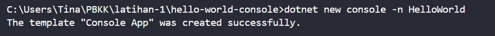

# Hello World Console

Program console sederhana yang menampilkan teks **"Hello, World!"** di terminal. Dibuat dengan bahasa C# dengan framework .NET SDK.

## Build & Run Program

1. **Inisialisasi project** dengan template `console`. Perintah ini otomatis membuat folder `HelloWorld` beserta file `HelloWorld.csproj` dan `Program.cs`.

   ```bash
   dotnet new console -n HelloWorld
   ```

   

2. **Masuk ke folder** project yang sudah dibuat, lalu jalankan programnya.

   ```bash
   cd HelloWorld
   dotnet run
   ```

   Perintah `dotnet run` sekaligus mengompilasi dan menjalankan program, tanpa perlu build terpisah.

   

## Penjelasan Kode

File utama program ini adalah `Program.cs`. Secara default, template `console` akan mengisi file tersebut dengan satu baris:

```csharp
Console.WriteLine("Hello, World!");
```

Perintah ini akan mencetak teks "Hello, World!" ke console.