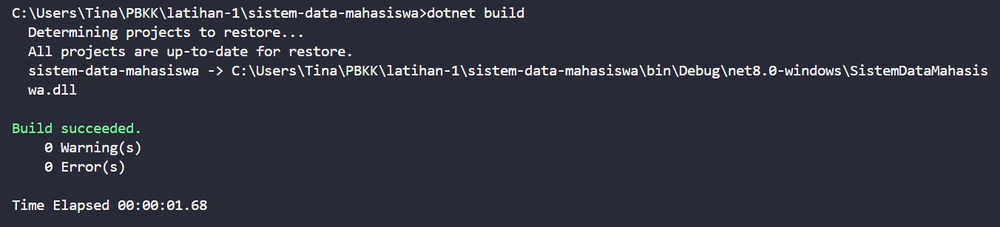
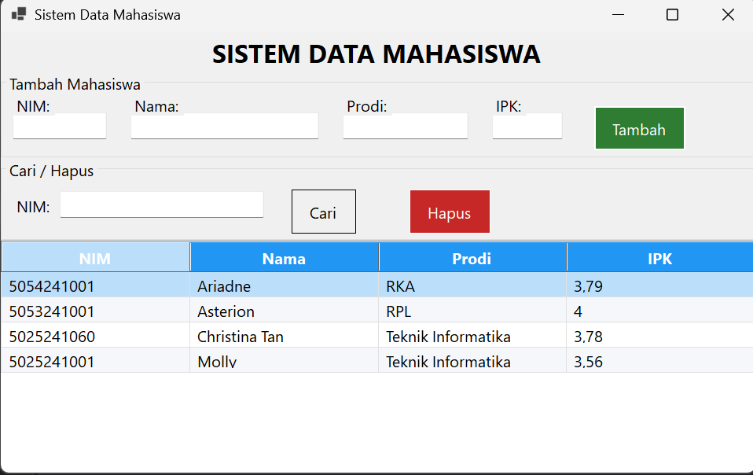
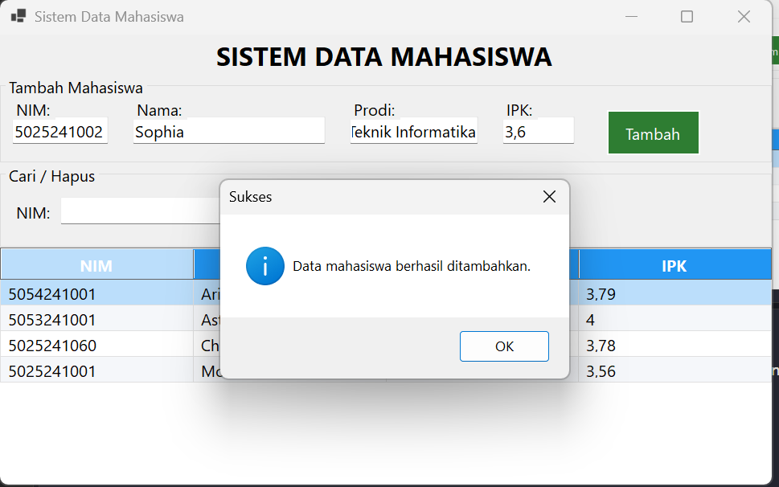
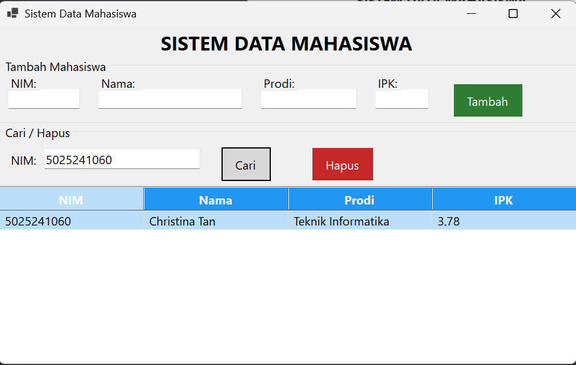
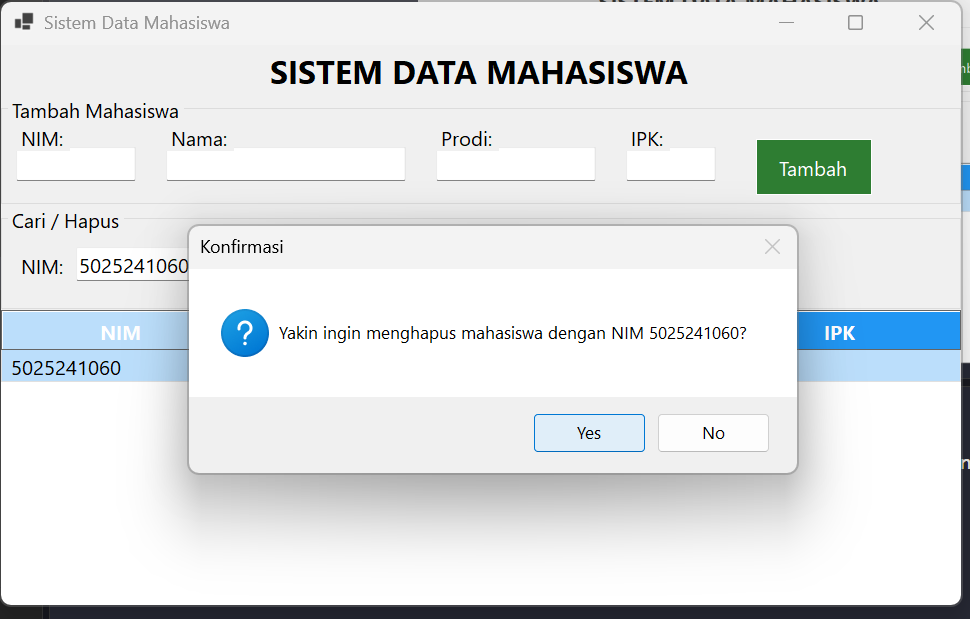
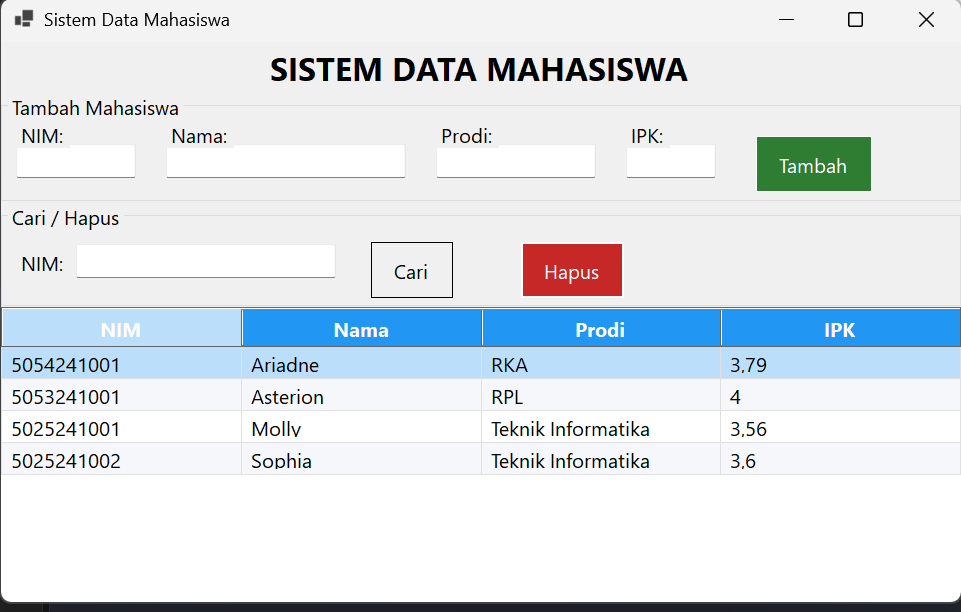

# Sistem Data Mahasiswa

Aplikasi desktop (Windows Forms) untuk menyimpan dan mengelola data mahasiswa, seperti NIM, nama, program studi, dan IPK. Program ini juga dilengkapi dengan penggunaan database SQLite pada aplikasi desktop.

Data yang ditambahkan tersimpan secara permanen di file SQLite `mahasiswa.db`, sehingga tidak hilang saat aplikasi ditutup.

## Fitur Aplikasi

- **Tambah** data mahasiswa (dengan validasi IPK 0–4 dan kewajiban mengisi semua kolom).
- **Tampilkan** seluruh data mahasiswa dalam tabel.
- **Cari** mahasiswa berdasarkan NIM.
- **Hapus** data mahasiswa (dengan konfirmasi sebelum menghapus).

## Build & Run Program

Dari folder project, jalankan perintah berikut melalui terminal:

```bash
dotnet build
dotnet run
```

`dotnet build` mengompilasi project, sedangkan `dotnet run` mengompilasi sekaligus menjalankan aplikasi. Perintah `dotnet run` sebenarnya sudah mencakup build, sehingga cukup menggunakan salah satunya.



## Tampilan Aplikasi

Saat aplikasi dibuka, seluruh data akan langsung ditampilkan dalam tabel.



### Menambah Data

Isi kolom NIM, nama, program studi, dan IPK, lalu tekan tombol **Tambah**.



### Mencari Data

Masukkan NIM pada kolom pencarian, lalu tekan **Cari**. Program akan menampilkan satu baris data yang cocok.



### Menghapus Data

Masukkan NIM, lalu tekan **Hapus**. Aplikasi akan meminta konfirmasi sebelum data dihapus.





## Penjelasan Kode

Proyek disusun menjadi beberapa file agar lebih rapi dan mudah dipahami:

| File | Fungsi |
|------|--------|
| `Program.cs` | Titik awal aplikasi, membuat form utama dan menjalankannya. |
| `Mahasiswa.cs` | Model data untuk merepresentasikan satu mahasiswa (NIM, nama, prodi, IPK). |
| `DatabaseHelper.cs` | Lapisan database: membuat tabel, dan menangani operasi tambah, tampilkan, cari, dan hapus. |
| `FormUtama.cs` | Tampilan utama (UI) beserta logika interaksi user. |

**Penjelasan singkat alur kerja:**

- `DatabaseHelper` memakai `Microsoft.Data.Sqlite` untuk berkomunikasi dengan file `mahasiswa.db`.
- Saat aplikasi dijalankan, `DatabaseHelper.Inisialisasi()` memastikan tabel `mahasiswa` sudah terbentuk.
- Setiap operasi (tambah, hapus, dan sebagainya) menggunakan parameter SQL (`$nim`, `$nama`, dan lainnya) agar aman dari *SQL injection*.
- Penggunaan parameter ini menjadikan program lebih aman, karena nilai input tidak disisipkan langsung ke dalam perintah SQL.
