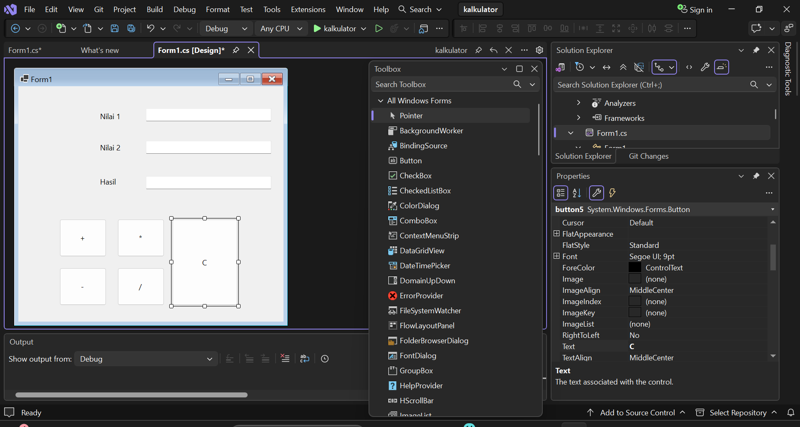
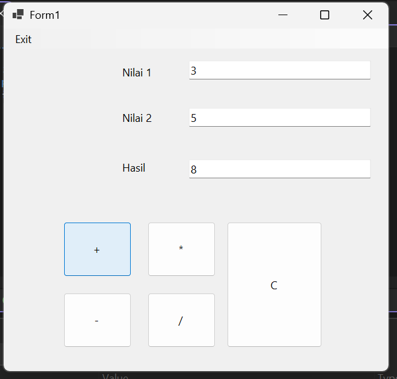
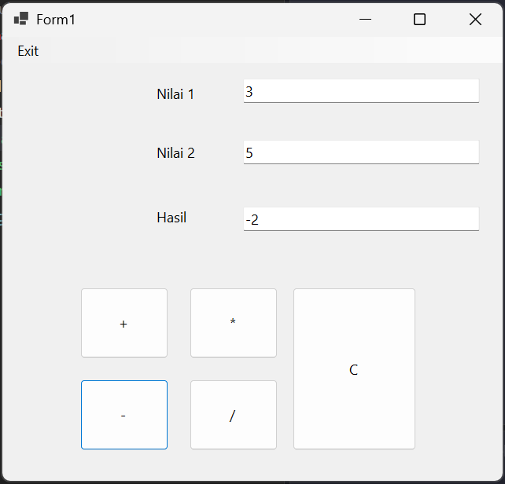
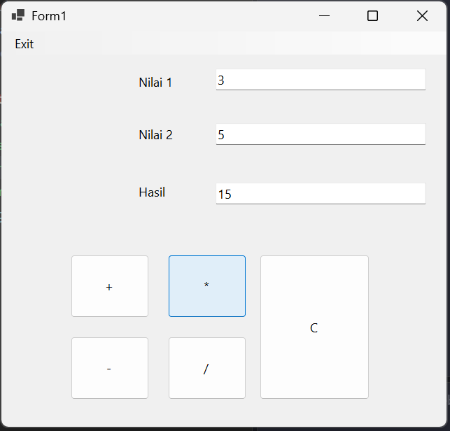
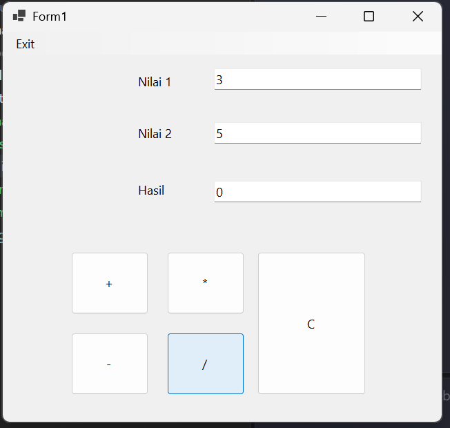
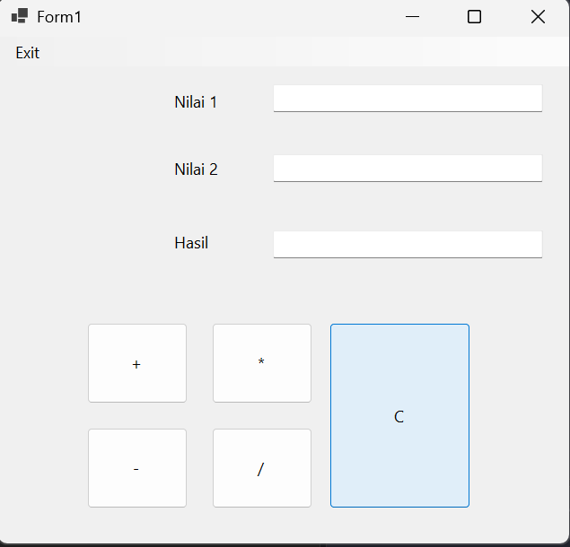

# Kalkulator Sederhana (Windows Forms)

Aplikasi desktop kalkulator sederhana yang dibuat menggunakan **Visual Studio** dengan bahasa pemrograman **C#** dan framework **Windows Forms**.

Program ini menerima dua bilangan pada kolom **Nilai 1** dan **Nilai 2**, lalu menghitung hasilnya berdasarkan tombol operasi yang ditekan atau diklik. Hasil perhitungan langsung ditampilkan pada kolom **Hasil**.

## Fitur Aplikasi

- **Penjumlahan** (`+`) dua bilangan.
- **Pengurangan** (`-`) dua bilangan.
- **Perkalian** (`*`) dua bilangan.
- **Pembagian** (`/`) dua bilangan, lengkap dengan penanganan pembagian oleh nol.
- **Clear** (`C`) untuk mengosongkan kembali semua kolom input dan hasil.
- **Exit** pada menu untuk menutup aplikasi.

## Tampilan Aplikasi

Desain form dibuat dengan komponen dari **Toolbox** Visual Studio: tiga `Label`, tiga `TextBox`, lima `Button`, dan satu `MenuStrip`.



Contoh penggunaan: isi Nilai 1 dengan `3` dan Nilai 2 dengan `5`, lalu klik tombol operasi.

### Penjumlahan

`3 + 5 = 8`



### Pengurangan

`3 - 5 = -2`



### Perkalian

`3 * 5 = 15`



### Pembagian

`3 / 5 = 0`



Hasilnya `0`, bukan `0,6`. Ini karena variabel yang dipakai bertipe `int` (bilangan bulat), sehingga angka di belakang koma dipotong. Penjelasan lebih lanjut ada di bagian [Penjelasan Kode](#penjelasan-kode).

### Clear

Tombol `C` akan mengosongkan kolom Nilai 1, Nilai 2, dan Hasil.



## Cara Membuat & Menjalankan Program

1. **Desain UI terlebih dahulu** di Visual Studio dengan komponen dari toolbox, sehingga susunan form-nya seperti gambar di bagian [Tampilan Aplikasi](#tampilan-aplikasi).

2. **Tambahkan fungsionalitas pada tiap komponen.** Klik komponen yang ingin diberi aksi, misalnya tombol operasi matematika (`+`, `-`, `*`, `/`), lalu isi kode di dalam event `Click`-nya.

3. **Jalankan programnya** dengan menekan tombol *Start* (F5) di Visual Studio. Kalkulator sudah bisa digunakan.

> Catatan: pada repository ini hanya disimpan file `src/Form1.cs` (bagian logika program). File lain seperti `Program.cs`, `Form1.Designer.cs`, dan file `.csproj` dibuat otomatis oleh Visual Studio dan tidak disertakan.

## Penjelasan Kode

### Komponen

Nama komponen bawaan Visual Studio (`textBox1`, `button1`, dan seterusnya) dipetakan ke fungsi masing-masing seperti berikut:

| Komponen | Tampilan | Fungsi |
|----------|----------|--------|
| `textBox1` | Nilai 1 | Menampung bilangan pertama. |
| `textBox2` | Nilai 2 | Menampung bilangan kedua. |
| `textBox3` | Hasil | Menampilkan hasil perhitungan. |
| `button1` | `+` | Menjumlahkan kedua bilangan. |
| `button3` | `-` | Mengurangkan kedua bilangan. |
| `button2` | `*` | Mengalikan kedua bilangan. |
| `button4` | `/` | Membagi kedua bilangan. |
| `button5` | `C` | Mengosongkan semua kolom. |
| `exitToolStripMenuItem` | Exit | Menutup aplikasi. |

### Kode Program

```csharp
namespace kalkulator
{
    public partial class Form1 : Form
    {
        public Form1()
        {
            InitializeComponent();
        }

        private void button1_Click(object sender, EventArgs e)
        {
            int nilai1 = int.Parse(textBox1.Text);
            int nilai2 = int.Parse(textBox2.Text);
            int hasil;
            hasil = nilai1 + nilai2;
            textBox3.Text = hasil.ToString();
        }

        private void button3_Click(object sender, EventArgs e)
        {
            int nilai1 = int.Parse(textBox1.Text);
            int nilai2 = int.Parse(textBox2.Text);
            int hasil;
            hasil = nilai1 - nilai2;
            textBox3.Text = hasil.ToString();
        }

        private void button2_Click(object sender, EventArgs e)
        {
            int nilai1 = int.Parse(textBox1.Text);
            int nilai2 = int.Parse(textBox2.Text);
            int hasil;
            hasil = nilai1 * nilai2;
            textBox3.Text = hasil.ToString();
        }

        private void button4_Click(object sender, EventArgs e)
        {
            int nilai1 = int.Parse(textBox1.Text);
            int nilai2 = int.Parse(textBox2.Text);
            int hasil;
            if (nilai2 != 0)
            {
                hasil = nilai1 / nilai2;
                textBox3.Text = hasil.ToString();
            }
            else
            {
                textBox3.Text = "Tidak bisa dibagi 0";
            }
        }

        private void button5_Click(object sender, EventArgs e)
        {
            textBox1.Text = "";
            textBox2.Text = "";
            textBox3.Text = "";
        }

        private void exitToolStripMenuItem_Click(object sender, EventArgs e)
        {
            this.Close();
        }
    }
}
```

### Alur Kerja Program

- **Membaca input.** Setiap tombol operasi mengambil isi `textBox1` dan `textBox2`, lalu mengubahnya dari teks menjadi bilangan bulat dengan `int.Parse()`.
- **Menghitung.** Hasil perhitungan disimpan pada variabel `hasil` bertipe `int`, sesuai operasi dari tombol yang diklik.
- **Menampilkan hasil.** Nilai `hasil` diubah kembali menjadi teks dengan `ToString()`, lalu dimasukkan ke `textBox3`.
- **Menangani pembagian.** Khusus tombol `/`, program memeriksa dulu apakah `nilai2` bernilai nol. Jika iya, hasilnya diisi teks `"Tidak bisa dibagi 0"` supaya aplikasi tidak error.
- **Mengosongkan kolom.** Tombol `C` cukup mengisi ketiga `TextBox` dengan string kosong `""`.
- **Menutup aplikasi.** Menu **Exit** memanggil `this.Close()` untuk menutup form.