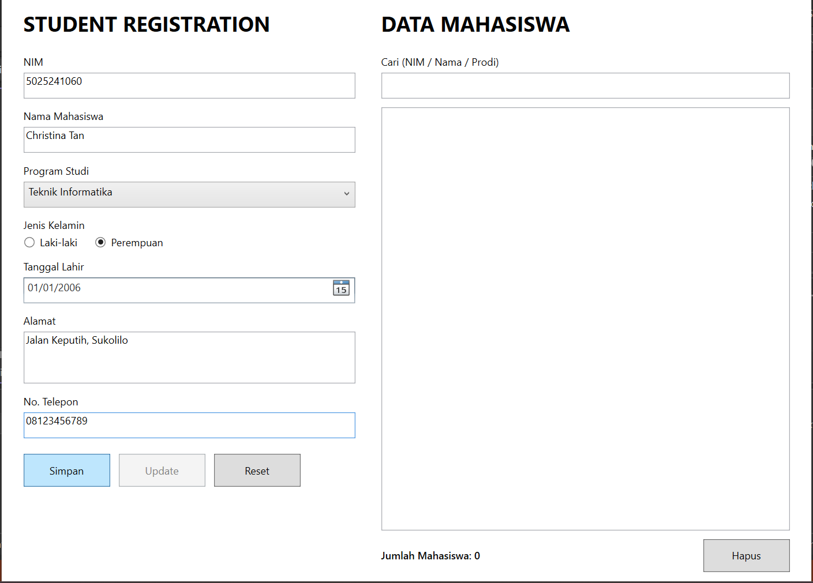
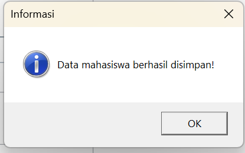
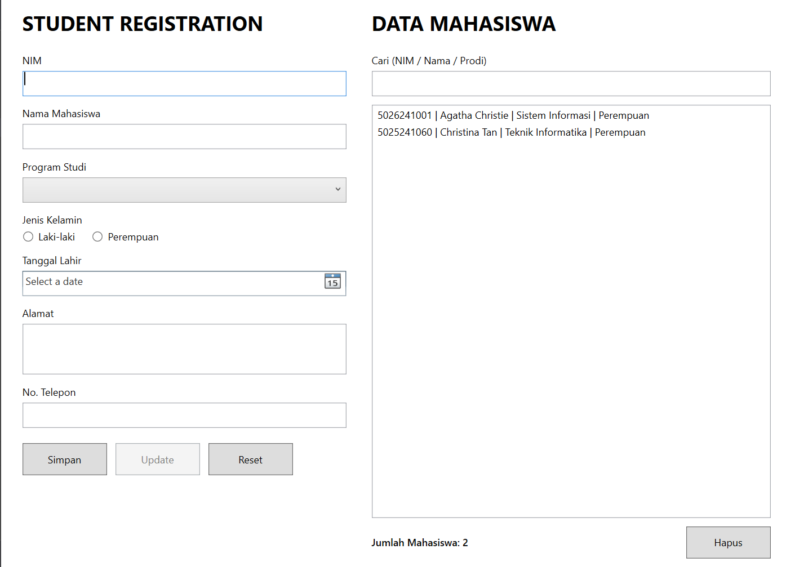
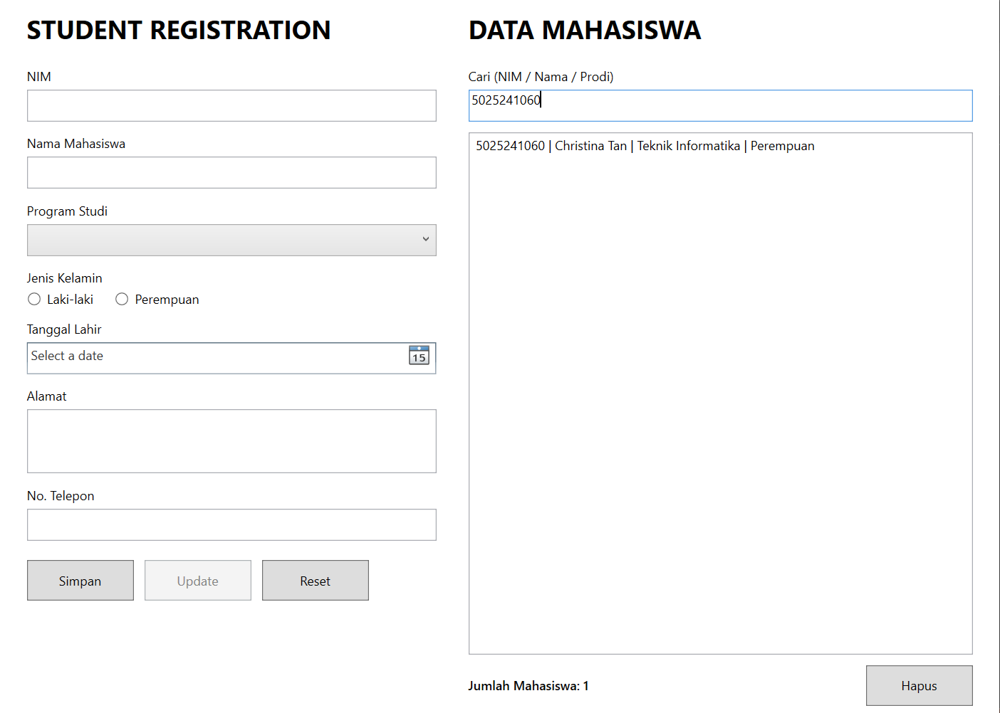
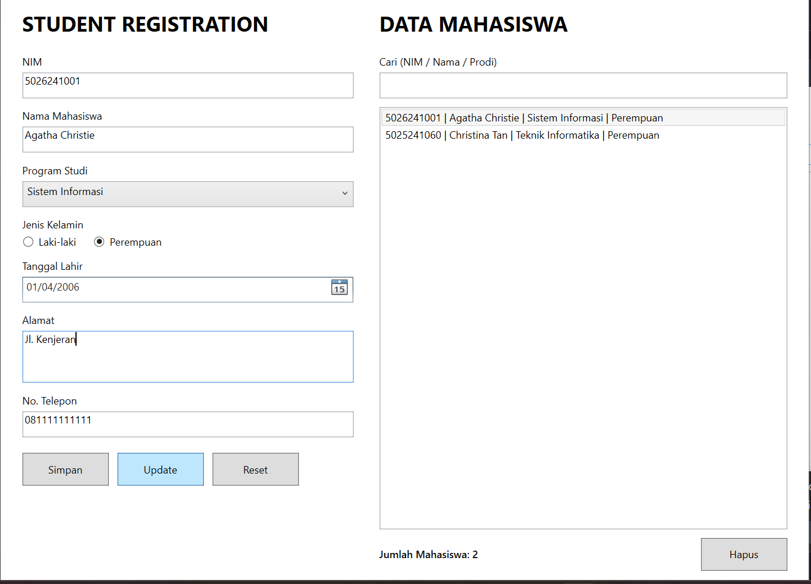
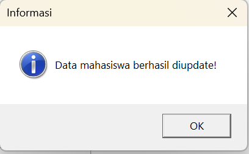
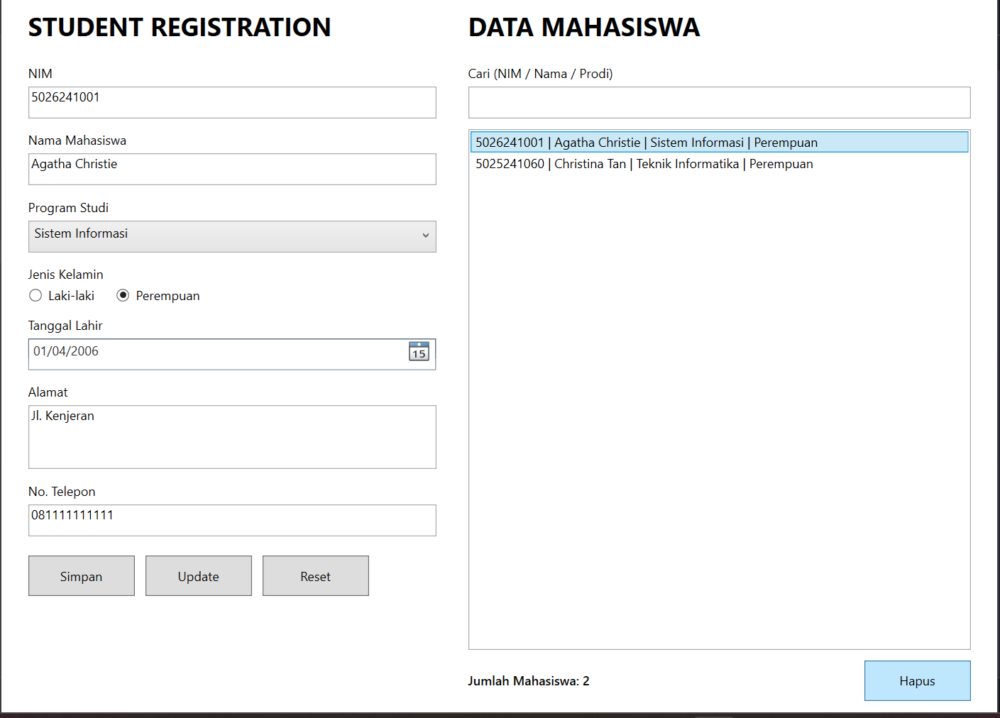
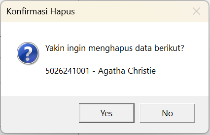
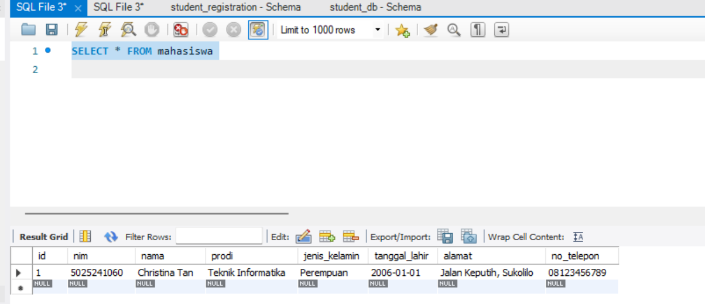

# Student Registration App

Nama: Christina Tan  
NRP: 5025241060

Ini adalah aplikasi desktop Student Registration yang dibuat menggunakan C# WPF di Visual Studio. Aplikasi ini digunakan untuk mengelola data mahasiswa, mulai dari menambahkan data, mencari data, mengupdate data, sampai menghapus data.

Data mahasiswa disimpan menggunakan database MySQL.

## Fitur aplikasi

### 1. Menambah data mahasiswa

User bisa mengisi data mahasiswa melalui form yang tersedia, yaitu:

- NIM
- Nama mahasiswa
- Program studi
- Jenis kelamin
- Tanggal lahir
- Alamat
- Nomor telepon

Sebelum disimpan, data akan divalidasi terlebih dahulu. Contohnya, NIM harus berupa angka dengan panjang 8 sampai 12 digit, nomor telepon harus diawali `08` atau `628`, dan NIM tidak boleh sama dengan data yang sudah ada.





### 2. Mencari data mahasiswa

Data mahasiswa dapat dicari berdasarkan **NIM, nama, atau program studi**. Pencarian dilakukan secara langsung saat user mengetikkan kata kunci pada kolom pencarian.





### 3. Mengupdate data mahasiswa

Untuk mengupdate data, user bisa memilih salah satu data dari daftar mahasiswa. Data tersebut akan otomatis masuk ke form di sebelah kiri. Setelah melakukan perubahan, klik tombol **Update**.





### 4. Menghapus data mahasiswa

User bisa memilih data yang ingin dihapus dari daftar, lalu klik tombol **Hapus**. Aplikasi akan menampilkan konfirmasi terlebih dahulu supaya data tidak terhapus secara tidak sengaja.





### 5. Menyimpan data ke MySQL

Semua data yang ditambahkan akan disimpan ke database MySQL, sehingga data tetap tersedia ketika aplikasi dibuka kembali.



<br>

## Cara menjalankan aplikasi

### 1. Menyiapkan database

Pastikan MySQL sedang berjalan, kemudian jalankan isi file [`src/schema.sql`](src/schema.sql) melalui MySQL Workbench atau aplikasi database lainnya.

File tersebut akan:

1. Membuat database `student_db` jika database belum tersedia.
2. Membuat tabel `mahasiswa`.
3. Menambahkan aturan agar NIM tidak boleh duplikat.

Struktur tabel yang digunakan adalah sebagai berikut:

| Kolom | Tipe data | Keterangan |
|---|---|---|
| `id` | `INT` | ID otomatis sebagai primary key |
| `nim` | `VARCHAR(20)` | NIM mahasiswa dan harus unik |
| `nama` | `VARCHAR(100)` | Nama mahasiswa |
| `prodi` | `VARCHAR(50)` | Program studi |
| `jenis_kelamin` | `VARCHAR(10)` | Jenis kelamin |
| `tanggal_lahir` | `DATE` | Tanggal lahir |
| `alamat` | `VARCHAR(255)` | Alamat mahasiswa |
| `no_telepon` | `VARCHAR(20)` | Nomor telepon |

### 2. Mengecek koneksi database

Pengaturan koneksi database ada di [`src/Database.cs`](src/Database.cs), tepatnya pada bagian `ConnectionString`.

Konfigurasi bawaan aplikasi adalah:

```text
Server=localhost
Port=3306
Database=student_db
Uid=root
Pwd=
```

Jika username, password, port, atau nama database di MySQL berbeda, bagian tersebut perlu disesuaikan terlebih dahulu.

### 3. Membuka project

1. Buka project WPF menggunakan Visual Studio.
2. Pastikan package `MySqlConnector` sudah tersedia.
3. Pastikan MySQL sudah aktif dan database `student_db` sudah dibuat.
4. Jalankan aplikasi dengan menekan tombol Start atau `F5`.

<br>

## Penjelasan kode

Source code utama aplikasi ada di folder [`src`](src). Setiap file memiliki tanggung jawab yang berbeda supaya kode lebih mudah dipahami dan dikelola.

### `MainWindow.xaml`

File [`src/MainWindow.xaml`](src/MainWindow.xaml) digunakan untuk membuat UI aplikasi menggunakan XAML.

Di dalam file ini terdapat:

- Form input data mahasiswa.
- `TextBox` untuk NIM, nama, alamat, dan nomor telepon.
- `ComboBox` untuk memilih program studi.
- `RadioButton` untuk memilih jenis kelamin.
- `DatePicker` untuk memilih tanggal lahir.
- Tombol **Simpan**, **Update**, **Reset**, dan **Hapus**.
- Kolom pencarian.
- `ListBox` untuk menampilkan daftar mahasiswa.
- Label jumlah mahasiswa.

Setiap tombol memiliki event, misalnya `BtnSimpan_Click`, yang akan menjalankan method tertentu di file `MainWindow.xaml.cs`.

### `MainWindow.xaml.cs`

File [`src/MainWindow.xaml.cs`](src/MainWindow.xaml.cs) berisi logika utama aplikasi dan mengatur interaksi antara UI dengan database.

#### Membaca dan menampilkan data

Method `LoadData()` memanggil `Database.GetAll()` untuk mengambil data dari MySQL. Hasilnya kemudian ditampilkan ke `ListBox` dan jumlah datanya ditampilkan pada label.

Method ini juga digunakan ketika kata kunci pencarian berubah, sehingga hasil pencarian dapat langsung diperbarui.

#### Menambah data

Method `BtnSimpan_Click()` menjalankan proses tambah data dengan urutan:

1. Memvalidasi isi form melalui `ValidateForm()`.
2. Membuat object mahasiswa melalui `BuildMahasiswa()`.
3. Menyimpan object tersebut menggunakan `Database.Insert()`.
4. Mengosongkan form dan memuat ulang daftar data.

#### Mengupdate data

Method `LstMahasiswa_SelectionChanged()` digunakan ketika user memilih data pada `ListBox`. Data yang dipilih akan dimasukkan kembali ke form dan tombol **Update** akan diaktifkan.

Kemudian, `BtnUpdate_Click()` akan mengambil data terbaru dari form dan mengirimkannya ke `Database.Update()`.

#### Menghapus data

Method `BtnHapus_Click()` mengambil data yang sedang dipilih, menampilkan konfirmasi, lalu memanggil `Database.Delete()` jika user memilih **Yes**.

#### Validasi form

Method `ValidateForm()` memastikan data yang dimasukkan sesuai aturan aplikasi, di antaranya:

- NIM wajib diisi dan harus terdiri dari 8 sampai 12 angka.
- Nama wajib diisi, minimal 3 karakter, dan hanya boleh berisi huruf, spasi, titik, apostrof, atau tanda hubung.
- Program studi dan jenis kelamin wajib dipilih.
- Tanggal lahir wajib diisi dan usia mahasiswa minimal 15 tahun.
- Alamat minimal memiliki 5 karakter.
- Nomor telepon harus diawali `08` atau `628`.
- NIM tidak boleh sudah digunakan oleh mahasiswa lain.

Selain validasi pada method tersebut, event `Angka_PreviewTextInput()` juga mencegah user mengetik karakter selain angka pada input NIM dan nomor telepon.

### `Mahasiswa.cs`

File [`src/Mahasiswa.cs`](src/Mahasiswa.cs) berisi model atau representasi data mahasiswa. Class `Mahasiswa` memiliki property yang sesuai dengan kolom pada tabel `mahasiswa`.

Method `ToString()` digunakan untuk menentukan format data ketika object mahasiswa ditampilkan di dalam `ListBox`:

```text
NIM | Nama | Program Studi | Jenis Kelamin
```

### `Database.cs`

File [`src/Database.cs`](src/Database.cs) berfungsi sebagai penghubung antara aplikasi dengan MySQL.

Method yang tersedia adalah:

- `GetAll()` untuk mengambil semua data atau mencari data berdasarkan keyword.
- `Insert()` untuk menambahkan data mahasiswa.
- `Update()` untuk mengubah data mahasiswa.
- `Delete()` untuk menghapus data berdasarkan ID.
- `NimExists()` untuk mengecek apakah NIM sudah digunakan.

Query menggunakan parameter seperti `@nim`, `@nama`, dan `@id`. Cara ini membuat input user tidak langsung digabungkan ke query SQL dan membantu menjaga query tetap aman.

Method `AddParams()` digunakan untuk menambahkan parameter yang sama pada proses insert dan update, sehingga kode tidak perlu ditulis berulang kali.

### `schema.sql`

File [`src/schema.sql`](src/schema.sql) berisi query untuk menyiapkan database dan tabel yang dibutuhkan aplikasi.

Tabel `mahasiswa` menggunakan `id` sebagai primary key dengan nilai yang bertambah otomatis. Kolom `nim` juga diberi constraint `UNIQUE`, sehingga satu NIM tidak dapat digunakan oleh lebih dari satu mahasiswa.

## Alur aplikasi

```text
User mengisi form
        ↓
Data divalidasi
        ↓
Database menerima query
        ↓
Data disimpan atau diubah di MySQL
        ↓
Daftar mahasiswa dimuat ulang
```

Dengan pembagian tersebut, XAML fokus pada UI, `MainWindow.xaml.cs` menangani aksi user, `Mahasiswa.cs` menyimpan bentuk data, dan `Database.cs` menangani komunikasi dengan MySQL.
