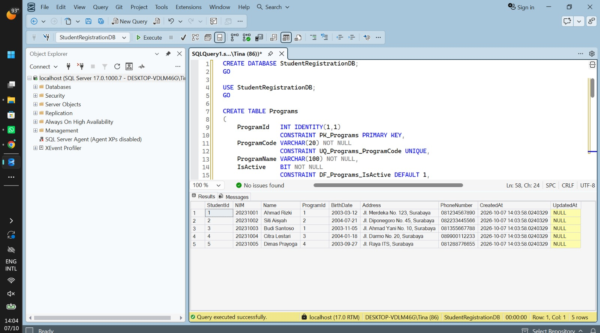
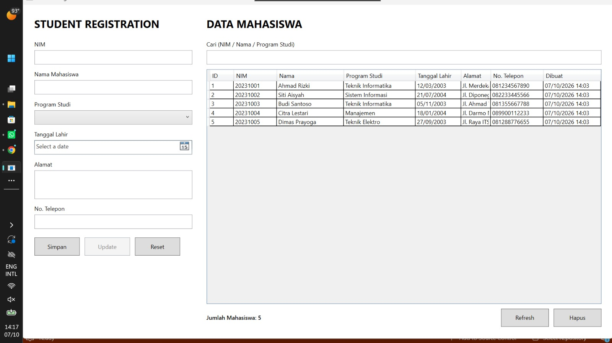
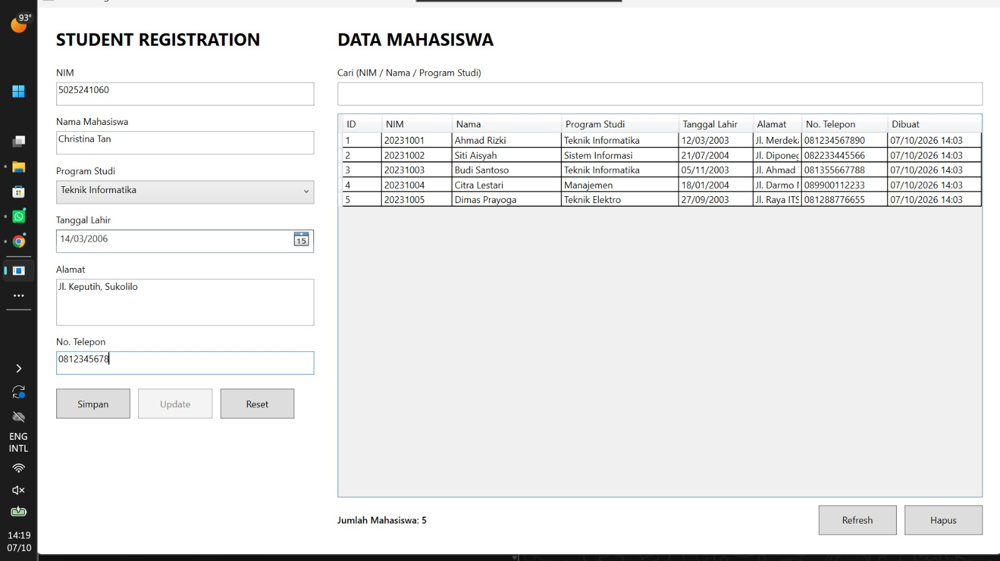
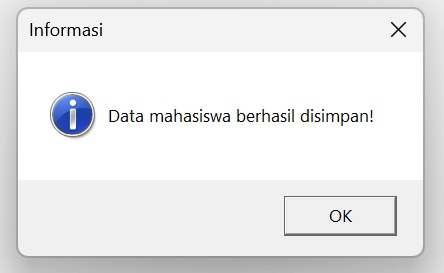
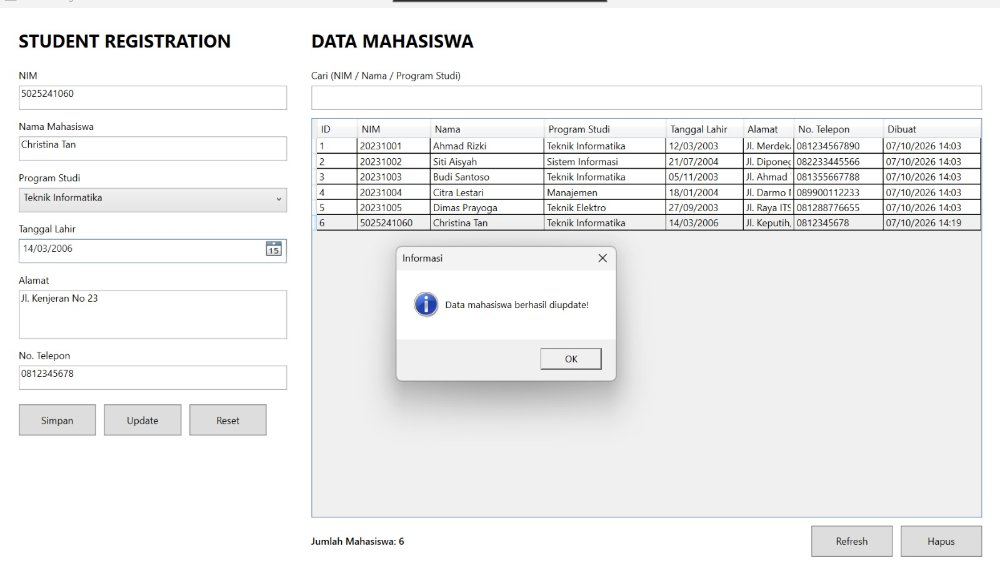
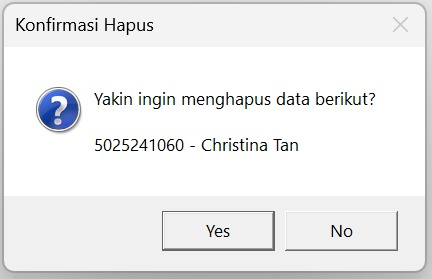
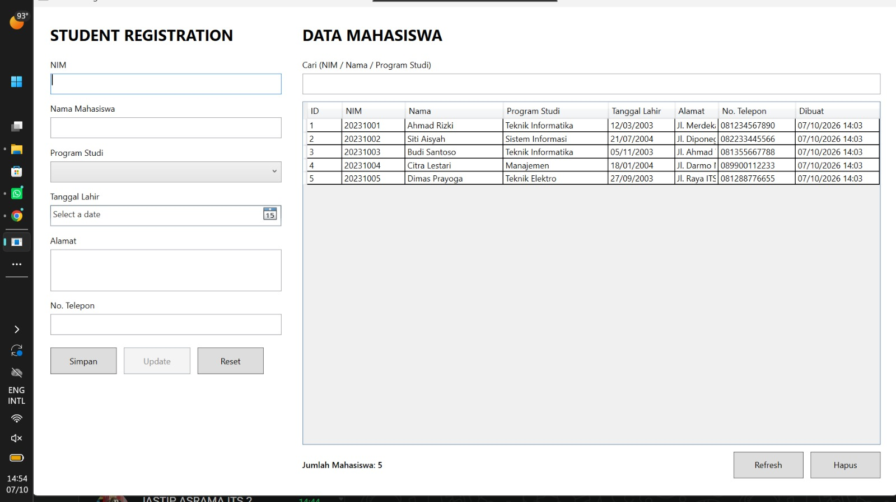

Aplikasi WPF dengan SQL Server ADO.NET

## Server dan database

Aplikasi menggunakan Microsoft SQL Server lokal dengan koneksi Windows
Authentication ke database `StudentRegistrationDB`. Connection string diatur
di `src/Repositories/DbConfig.cs` dan menggunakan `TrustServerCertificate=True`
untuk koneksi lokal.

Jalankan seluruh isi `src/sqlquery.sql` di SQL Server Management Studio atau
Azure Data Studio untuk membuat database, tabel, constraint, dan data awal.
Script tersebut membuat tabel `Programs` sebagai master program studi dan
`Students` sebagai data mahasiswa. Relasi keduanya terhubung oleh foreign key
`Students.ProgramId` ke `Programs.ProgramId`, sedangkan NIM dibuat unik oleh
constraint `UQ_Students_NIM`.

 

## Dokumentasi Aplikasi

Menjalankan query SQL untuk membangun database dan isinya di SQL Server Microsoft

 

Tampilan awal WPF, data list program studi dan list mahasiswa diload dari database SQL Server

 

Menambahkan data baru melalui form

 

Memperbarui data

 

Menghapus data, terdapat konfirmasi tentang penghapusan terlebih dahulu dulu

 

## Penjelasan kode dan query

Berikut fungsi setiap file pada folder `src`:

- `MainWindow.xaml` berisi rancangan UI WPF, yaitu form input
  mahasiswa, pilihan program studi, tombol CRUD, kotak pencarian, dan
  `DataGrid` untuk menampilkan data.
- `MainWindow.xaml.cs` berisi logika utama aplikasi dan event handler untuk
  menyimpan, mengubah, mereset, menghapus, mencari, serta memuat data.
  File ini juga melakukan validasi NIM, nama, tanggal lahir, alamat, dan
  nomor telepon sebelum data dikirim ke database.
- `Models/Student.cs` adalah model data mahasiswa yang merepresentasikan
  kolom pada tabel `Students`, seperti NIM, nama, program studi, alamat, dan
  tanggal lahir.
- `Models/Program.cs` adalah model data program studi yang merepresentasikan
  kolom pada tabel `Programs`.
- `Repositories/DbConfig.cs` menyimpan connection string SQL Server agar
  konfigurasi koneksi terpusat dan dapat digunakan oleh semua repository.
- `Repositories/ProgramRepository.cs` mengambil daftar program studi aktif
  dari tabel `Programs` untuk ditampilkan pada `ComboBox`.
- `Repositories/StudentRepository.cs` menangani operasi database mahasiswa
  menggunakan ADO.NET, mulai dari membaca, menambah, mengubah, sampai
  menghapus data.
- `sqlquery.sql` berisi query untuk membuat database, tabel, primary key,
  foreign key, unique constraint, data awal program studi, dan data awal
  mahasiswa.

### Query dan koneksi database

`ProgramRepository` mengambil program studi aktif dengan `SELECT` dan
`ORDER BY ProgramName`. `StudentRepository` menangani seluruh operasi data
mahasiswa menggunakan ADO.NET:

- `GetAll` melakukan `INNER JOIN` ke `Programs` untuk melakukan pencarian pada
  NIM, nama, atau program studi.
- `GetTotal` mengambil jumlah seluruh mahasiswa dengan `COUNT(*)`.
- `Insert`, `Update`, dan `Delete` menggunakan parameterized query untuk
  mencegah SQL injection. Update juga mengisi `UpdatedAt` menggunakan
  `SYSDATETIME()`.
- `NimExists` memeriksa duplikasi NIM sebelum insert atau update.

Setiap query menggunakan `SqlConnection`, `SqlCommand`, dan parameter dari
`Microsoft.Data.SqlClient`. Event handler pada `MainWindow.xaml.cs` mengatur
validasi form, pemuatan data ke `DataGrid`, konfirmasi penghapusan, serta
menampilkan error koneksi/database kepada pengguna.